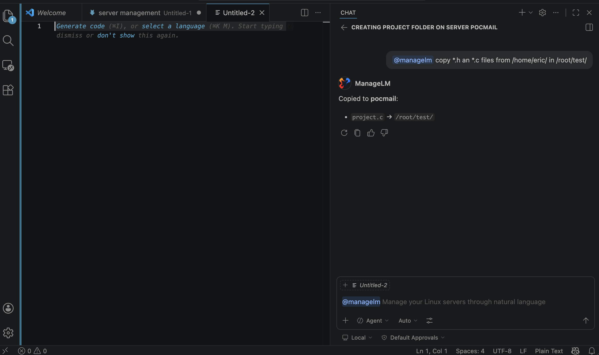

<p align="center">
  <a href="https://www.managelm.com">
    
  </a>
</p>

<h3 align="center">VS Code Extension</h3>

<p align="center">
  Manage Linux &amp; Windows servers from VS Code Copilot Chat using natural language.
</p>

<p align="center">
  <a href="LICENSE"></a>
  <a href="https://www.managelm.com"></a>
  <a href="https://www.managelm.com/plugins/vscode.html"></a>
  <a href="https://github.com/managelm/vscode-extension/releases"></a>
</p>

<p align="center">
  
</p>

---

Type `@managelm` in Copilot Chat to check system status, manage packages, configure services, run security audits, and more — across one server or an entire fleet. The extension connects Copilot to your infrastructure through the ManageLM portal and lightweight agents on your servers.

## Features

- **Natural language** — describe tasks in plain English; the extension picks the right tool
- **13 built-in tools** — list servers, run tasks, check status, security audits, inventory, and more
- **Multi-server targeting** — target a hostname, group, or all agents
- **Interactive tasks** — when the agent needs input, Copilot asks you and answers automatically
- **Security audits** — start audits and view findings with severity and remediation
- **Inventory scans** — discover packages, services, containers
- **Cross-infrastructure search** — find agents by health/OS, search inventory, security, SSH keys
- **Copilot native** — works inside Copilot Chat, no separate UI

## Quick Start

### 1. Install

From the VS Code Marketplace:

```bash
code --install-extension managelm.managelm
```

Or download the `.vsix` from [GitHub Releases](https://github.com/managelm/vscode-extension/releases).

### 2. Configure

1. Open **Settings** (`Cmd+,` / `Ctrl+,`) and search for **ManageLM**
2. Set your **API Key** (from Portal > Settings > MCP & API)
3. (Optional) Set your **Portal URL** if self-hosting

### 3. Use it

Open Copilot Chat and type `@managelm` followed by your request:

```
@managelm show me all my servers

@managelm check disk usage on web-prod-01

@managelm install nginx on all servers in the staging group

@managelm run a security audit on db-primary

@managelm which servers have CPU above 80%?

@managelm approve the new server that just enrolled
```

## Architecture

```
VS Code Copilot Chat ── REST API ──> ManageLM Portal ── WebSocket ──> Agent on Server
  @managelm                          (cloud control      (outbound      (local LLM,
                                      plane)              only)          skill exec)
```

Agents use a local LLM — your data never leaves your infrastructure. No SSH, no inbound ports.

## Available Tools

| Tool | Description |
|------|-------------|
| `listAgents` | All servers with status, health, OS, IPs |
| `agentInfo` | Detailed info for a single server |
| `runTask` | Execute a skill-based task on a server |
| `getTaskStatus` | Check task status and result |
| `getTaskHistory` | Recent tasks for a server |
| `approveAgent` | Approve a pending enrollment |
| `listSkills` | All skills in your account |
| `agentSkills` | Skills assigned to a server |
| `getSecurity` | Security audit findings |
| `getInventory` | System inventory (packages, services, containers) |
| `runSecurityAudit` | Start a security audit |
| `runInventoryScan` | Start an inventory scan |
| `accountInfo` | Account plan, members, usage |

## Requirements

- **VS Code 1.99+** with GitHub Copilot Chat
- **ManageLM account** — [sign up free](https://app.managelm.com/register) (up to 10 agents)
- **ManageLM Agent** — installed on each server you want to manage
- **API Key** — from Portal > Settings > MCP & API

## Development

```bash
npm install        # install dependencies
npm run build      # compile TypeScript
npm run watch      # watch mode
npm run package    # create .vsix
```

## Other Integrations

- [Claude Code Extension](https://github.com/managelm/claude-extension) — MCP integration for Claude
- [ChatGPT Plugin](https://github.com/managelm/openai-gpt) — manage servers from ChatGPT
- [n8n Plugin](https://github.com/managelm/n8n-plugin) — infrastructure automation workflows
- [Slack Plugin](https://github.com/managelm/slack-plugin) — notifications and commands in Slack
- [OpenClaw Plugin](https://github.com/managelm/openclaw-plugin) — OpenClaw integration

## Links

- [Website](https://www.managelm.com)
- [Full Documentation](https://www.managelm.com/plugins/vscode.html)
- [Portal](https://app.managelm.com)

## License

[Apache 2.0](LICENSE)
